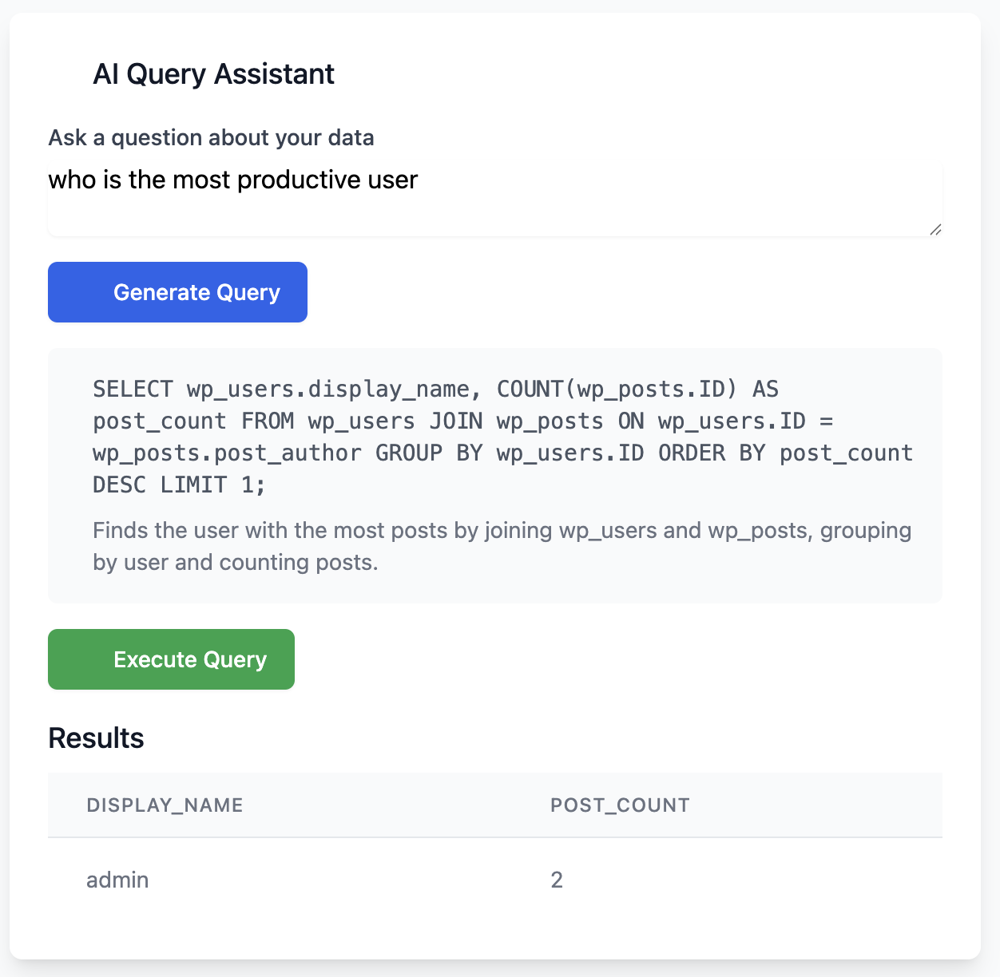

<!--
Changes made:
2025-03-16: Created README with project overview, features, setup instructions, and technical details
2025-03-16: Made content database-focused, improved error handling docs, enhanced technical stack details
-->

# Database AI Query Assistant 🤖

A powerful tool that helps you explore and query your MySQL database using natural language. Simply ask questions in plain English, and let the AI generate optimized SQL queries for you. Built with Express, TypeScript, Vue.js, and Google's Gemini AI.


## 🎥 Preview

Check out the video preview of the tool in action:

https://db-ai-assistant.flipboxstudio.com/DB%20AI%20Assistant.mp4

## 🌐 Live Demo

Try the live demo here: [https://db-ai-assistant.flipboxstudio.com/](https://db-ai-assistant.flipboxstudio.com/)

## ✨ Features

- **Natural Language to SQL**: Convert English questions into optimized SQL queries
- **Smart Error Handling**: AI-powered query regeneration when errors occur
- **Schema Visualization**: Clean, organized view of your database structure
- **Query Generation**: AI-powered SQL generation with safety checks
- **Flexible Connection**: Support for both standard parameters and connection strings
- **Safety Controls**: Built-in protection against unsafe operations (UPDATE/DELETE)
- **Modern UI/UX**: Beautiful, responsive interface with Tailwind CSS
- **Real-time Results**: Instant query execution with error recovery

## 🚀 Getting Started

### Prerequisites

- Node.js >= 14
- MySQL database (any version)
- Google Gemini API key

### Installation

1. Clone the repository

2. Install dependencies:
```bash
npm install
```

3. Set up environment:
```bash
cp .env.example .env
```

4. Configure your `.env`:
```env
# API Configuration
PORT=3001
GEMINI_API_KEY=your_gemini_api_key

# Security Settings
ALLOW_UNSAFE_QUERIES=false
```

5. Start the server:
```bash
npm run dev
```

6. Open [http://localhost:3001](http://localhost:3001)

## 💡 Usage

1. **Database Connection**:
   - Use standard parameters (host, port, credentials)
   - Or paste a MySQL connection string
   - Real-time validation with error feedback
   - Secure credential handling

2. **Schema Explorer**:
   - Visual database structure overview
   - Detailed table and column information
   - Type, key, and constraint details
   - Clean, organized layout

3. **AI Query Generation**:
   - Ask questions in plain English
   - Get optimized SQL with explanations
   - Automatic query regeneration on errors
   - Safety checks and validations

4. **Smart Error Handling**:
   - AI-powered query correction
   - Clear error explanations
   - One-click query regeneration
   - Safe query execution

## 🛠️ Technical Stack

### Core Technologies
- **Frontend**: Vue.js with Tailwind CSS
- **Backend**: Express with TypeScript
- **AI**: Google's Gemini for natural language processing
- **Database**: MySQL compatibility

### Design Principles
- Beautiful, production-ready UI/UX
- Component-based (max 300 lines)
- Single responsibility functions (max 20 lines)
- Type safety with TypeScript
- Error recovery and regeneration
- Clean, maintainable code

### Backend
- Express.js with TypeScript
- MySQL2 with connection pooling
- Gemini AI for natural language processing
- Structured error handling with specific codes

### Frontend
- Vue.js 3 (preferred over React)
- Tailwind CSS for styling
- Lucide Icons for static icons
- Potlab Icons for animations (https://www.potlabicons.com/)

### Code Quality Standards
- Type hints mandatory
- No unnecessary comments or docstrings
- Keep TODO comments
- Merge comments with same date
- File headers track changes with dates
- Refactor unused code, never delete used functions
- Test for readability first, performance second

## 🔒 Security

- Connection credentials are never stored
- Unsafe operations are blocked by default
- Input validation and SQL injection prevention
- Environment-based configuration

## 🤝 Contributing

1. Fork the repository
2. Create your feature branch: `git checkout -b feature/amazing-feature`
3. Commit your changes: `git commit -m 'Add amazing feature'`
4. Push to the branch: `git push origin feature/amazing-feature`
5. Open a Pull Request

## 📝 License

This project is licensed under the MIT License - see the [LICENSE](LICENSE) file for details.

## 🙏 Acknowledgments

- Google Gemini AI for natural language processing
- The Vue.js team for the amazing framework
- The Tailwind CSS team for the utility-first CSS framework
- The MySQL team for the robust database system
