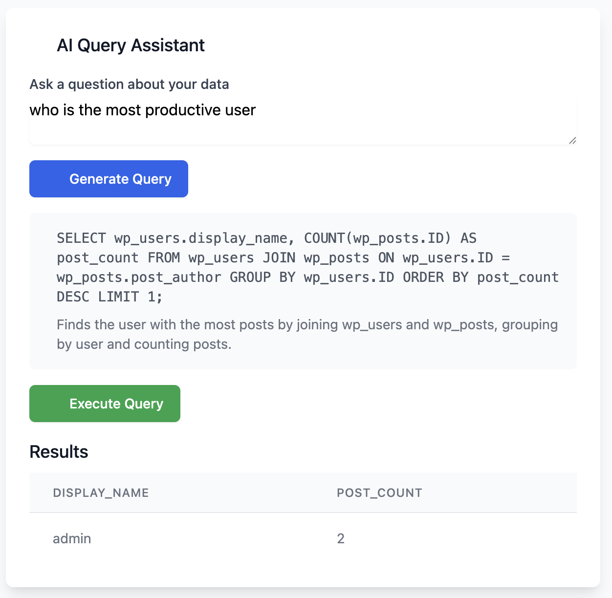

# Can AI Replace Junior Data Analysts? Exploring the Future with Database AI Query Assistant

In the rapidly evolving landscape of data analysis, a question increasingly echoes through boardrooms and tech circles: **Can AI replace junior data analysts?** To explore this question, I've built the Database AI Query Assistant—an experimental platform that transforms natural language questions into optimized SQL queries using Google's Gemini AI.

## The Current State of Data Analysis

Junior data analysts typically spend a significant portion of their time on repetitive tasks:

- Writing and debugging SQL queries
- Extracting data from databases
- Formatting results for stakeholders
- Explaining query logic to non-technical team members

These tasks, while essential, often don't leverage the full analytical potential of human analysts. They're mechanical, rule-based, and ripe for automation.

## Introducing Database AI Query Assistant

The Database AI Query Assistant is an experimental platform designed to automate the query generation process. It allows users to:

1. Connect to any MySQL database
2. Ask questions in plain English
3. Receive optimized SQL queries with explanations
4. Execute queries and view results instantly

The platform leverages Google's Gemini AI to understand natural language, analyze database schemas, and generate appropriate SQL queries—all while maintaining safety controls to prevent destructive operations.

## How It Works: Behind the Scenes

When a user asks a question like "How many orders were placed last month by customers in New York?", several processes occur:

1. **Schema Analysis**: The system analyzes the database structure, including tables, columns, relationships, and sample data
2. **Natural Language Processing**: Gemini AI interprets the question and maps it to database entities
3. **SQL Generation**: The AI generates an optimized SQL query with proper JOINs and conditions
4. **Safety Validation**: The system checks for unsafe operations (UPDATE/DELETE)
5. **Execution & Error Handling**: If an error occurs, the AI automatically attempts to fix the query

The most impressive aspect is the error handling—when a query fails, the system captures the error message, feeds it back to the AI, and regenerates a corrected query.

## The Experiment: AI vs. Junior Data Analyst

To test the system's capabilities, I conducted an experiment comparing the Database AI Query Assistant against tasks typically performed by junior data analysts:

| Task | Junior Analyst | AI Assistant | Winner |
|------|---------------|-------------|--------|
| Simple queries (SELECT with basic conditions) | ✅ 3-5 minutes | ✅ 2-3 seconds | AI |
| Complex joins (3+ tables) | ✅ 10-15 minutes | ✅ 5-10 seconds | AI |
| Aggregations and grouping | ✅ 5-10 minutes | ✅ 3-5 seconds | AI |
| Error correction | ✅ 5-15 minutes | ✅ 3-5 seconds | AI |
| Novel analytical approaches | ✅ Variable | ❌ Limited to patterns | Human |
| Business context understanding | ✅ Strong | ❌ Limited | Human |
| Data quality assessment | ✅ Strong | ❌ Weak | Human |

The results were illuminating. For routine query tasks, the AI outperformed humans in both speed and consistency. However, for tasks requiring deeper business context, creative thinking, or data quality assessment, human analysts maintained a clear advantage.

## The Limitations: Where AI Falls Short

Despite impressive capabilities, the AI assistant has significant limitations:

1. **Context Understanding**: While it can generate queries based on schema, it lacks understanding of business rules not explicitly defined in the database
2. **Data Quality Assessment**: It cannot identify potential data quality issues unless they cause query errors
3. **Creative Problem-Solving**: The AI follows patterns rather than inventing novel analytical approaches
4. **Adaptability**: It struggles with highly specialized domain knowledge or rapidly changing requirements

These limitations highlight that AI is better suited as a productivity tool for analysts rather than a complete replacement.

## The Future: Augmentation, Not Replacement

The Database AI Query Assistant demonstrates that AI can automate significant portions of a junior data analyst's workload. However, the experiment suggests a future of augmentation rather than replacement:

- **Junior analysts** can leverage AI to handle routine query generation, freeing time for higher-value analysis
- **Experienced analysts** can use AI as a productivity multiplier, quickly testing hypotheses and exploring data
- **Non-technical stakeholders** can directly access data insights without technical intermediaries

The most likely outcome is a transformation of the junior analyst role—evolving from SQL writers to insight interpreters who leverage AI tools while providing the critical human elements of context, creativity, and judgment.

## Technical Implementation

The Database AI Query Assistant is built with a modern tech stack:

- **Backend**: Express.js with TypeScript
- **Frontend**: Vue.js with Tailwind CSS
- **AI**: Google's Gemini for natural language processing
- **Database**: MySQL compatibility

The architecture follows clean design principles with component-based development, single responsibility functions, and comprehensive error handling. The entire system is containerized with Docker for easy deployment.

## Try It Yourself

The platform is available as an open-source project for experimentation:

- **Live Demo**: [https://db-ai-assistant.flipboxstudio.com/](https://db-ai-assistant.flipboxstudio.com/)
- **Video Preview**: [Watch the demo](https://db-ai-assistant.flipboxstudio.com/DB%20AI%20Assistant.mp4)
- **GitHub Repository**: [Database AI Query Assistant](https://github.com/aqidd/ai-sql-generator)

## Conclusion: The Human-AI Partnership

So, can AI replace junior data analysts? The answer is nuanced. AI can automate many routine tasks performed by junior analysts, potentially reducing the number of entry-level positions. However, it cannot replace the uniquely human capabilities of context understanding, creative problem-solving, and business acumen.

The most productive path forward is a partnership—where AI handles the mechanical aspects of data analysis while humans focus on interpretation, innovation, and strategic decision-making. Junior analysts who embrace AI tools will likely evolve into more valuable roles that emphasize these distinctly human strengths.

The Database AI Query Assistant isn't about replacing analysts—it's about elevating them to focus on what humans do best.

What do you think? Will AI replace or augment junior data analysts? I'd love to hear your thoughts in the comments.
